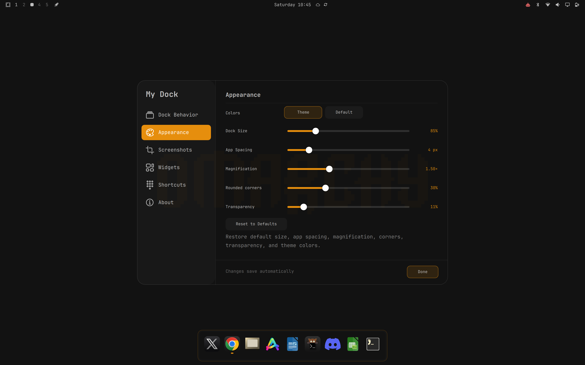
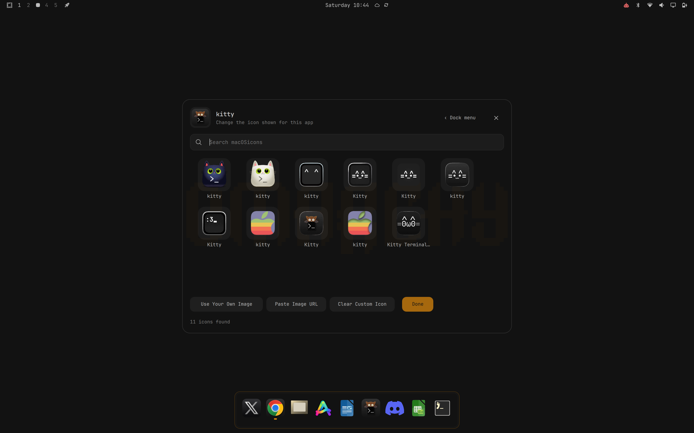
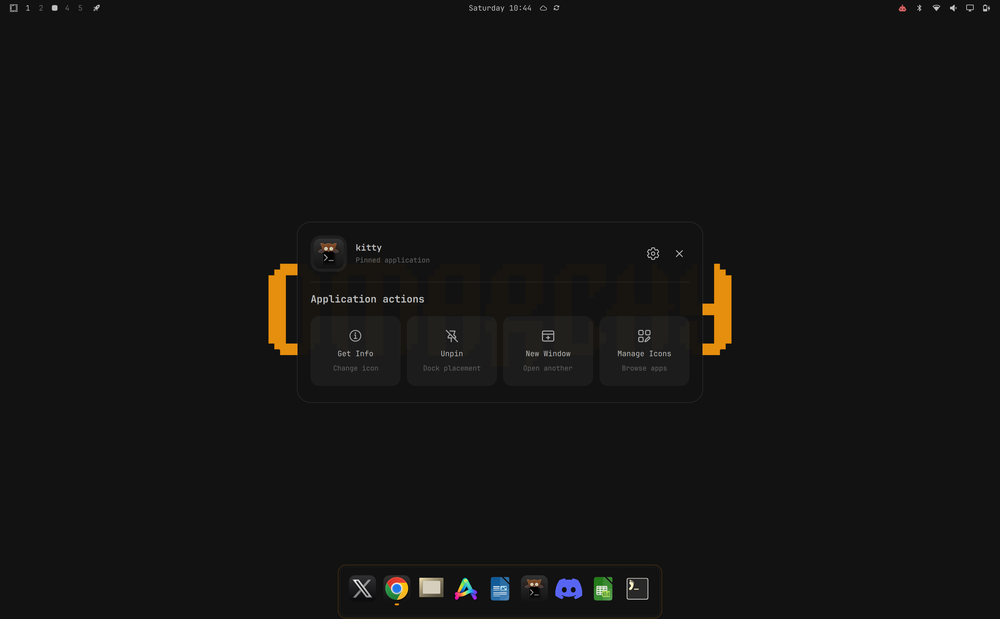
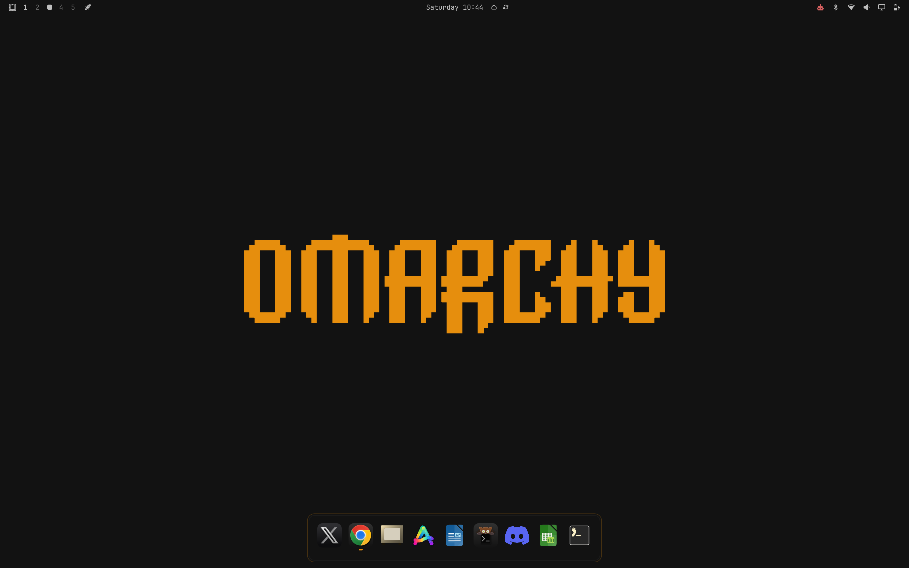

# My Dock

My Dock is a macOS-inspired Omarchy panel dock with pointer magnification,
launch animation, pinning, app ordering, auto-hide, side placement, an app
switcher, icon management, and a separate settings view. Window thumbnail
previews are disabled; hovering an app shows its name.

The dock surface can follow the active Omarchy theme or use a charcoal default
style. Magnification, corner rounding, transparency, auto-hide, and placement
are adjustable from the dock settings and are saved under `~/.config/omarchy/`.

## Screenshots

### Appearance settings



### Icon picker



### Application actions



### Desktop and dock



## Install

Review the source before enabling it. Omarchy plugins run as unsandboxed code
inside the long-lived shell process.

```bash
omarchy plugin add https://github.com/stash-11/Dock.git --enable --yes
```

The plugin ID is `io.github.stash-11.dock`. The helper script is optional and
is used only for custom icon search and management:

```bash
mkdir -p ~/.local/bin
ln -sf ~/.config/omarchy/plugins/io.github.stash-11.dock/scripts/omarchy-dock-icon ~/.local/bin/omarchy-dock-icon
```

## Use

Right-click an app to open application actions. Select the settings icon for
Dock Options and Appearance. The settings page includes Theme or Default
colors, magnification, rounded corners, transparency, auto-hide, and dock
placement. Settings use a sidebar with Dock Behavior, Appearance, Screenshots,
Shortcuts, and About pages. Screenshots can save to a file, the clipboard, or
both; this preference also applies to the capture dock. Screenshots also has a separate
magnification slider (Off–2.5×). Bundled UI icons follow the selected theme. Open settings directly
with `omarchy-shell io.github.stash-11.dock settings` (use `macos.dock` for legacy
installations).

The app switcher uses `Alt+Tab` and `Alt+Shift+Tab`; `Alt+Grave` and
`Alt+Shift+Grave` are also available. The dock exposes IPC commands through
`omarchy-shell -q io.github.stash-11.dock`, including `show`, `hide`, `toggle`,
`toggleAutoHide`, `setAutoHide`, `getAutoHide`, `altTabNext`, `altTabPrev`, and
`altTabCancel`.

Replace the app icons with screenshot controls inside the dock:

```bash
omarchy-shell io.github.stash-11.dock screenshot
```

For an existing installation named `macos.dock`, use
`omarchy-shell macos.dock screenshot` after updating its installed files.

Choose **Window**, **Full Screen**, or **Region**. The dock hides before
capture starts and returns to apps afterward. **Back** restores the apps without capturing. Repeating the IPC command
keeps the screenshot controls open. Omarchy handles selection, saving, and
clipboard copying.

## Widgets and shortcuts

Settings → Shortcuts shows the screenshot IPC command for the installed plugin
ID and a Run button that opens the capture dock.

Settings → Widgets lets you add and remove Music, Clock, and Weather cards.
Cards share one compact stack to the left of the bottom dock; they never change
the app dock's dimensions. Click to expand, use arrows or scroll to change cards,
and click Collapse or press Escape to close. The stack is hidden for side-mounted
docks and during screenshots. There is no fixed card-count limit.

Music cards use MPRIS-compatible players; click Player to cycle through available
players or Automatic. Clock uses local time. Weather uses `omarchy-weather-status`
with the configured Omarchy location, refreshing every 15 minutes while a weather
card is configured. It contacts the weather service only when a weather card is
added; failed requests show an unavailable message and can be retried.

## Requirements and dependencies

The plugin requires Omarchy Quickshell with the `qs.Commons` and `qs.Ui`
modules, a Wayland layer-shell compositor, and the standard Omarchy runtime.
The optional icon helper additionally uses Bash, Python 3, curl, ImageMagick
(`magick` or `convert` and `identify`), and `xdg-open`.

The helper can download icon files only when the user explicitly requests an
icon search or URL. Downloaded icons and mappings are stored under the user's
Omarchy configuration. The plugin does not collect telemetry. Optional Weather cards contact the
weather service through Omarchy while configured.

## Removal

Disable and remove the plugin through Omarchy so the shell state is updated:

```bash
omarchy plugin disable io.github.stash-11.dock
omarchy plugin remove io.github.stash-11.dock --yes
omarchy restart shell
```

The plugin does not overwrite existing Omarchy configuration without an
explicit dock action. Settings, pins, and custom icons created by the user may
remain under `~/.config/omarchy/`; remove those files only if you want to
delete the saved dock state.

## Development and validation

```bash
./tests/run.sh
omarchy plugin validate .
```

## License and attribution

This repository is MIT licensed. It is a modified, separately maintained
version of the Omarchy dock implementation by ifubaraboye; upstream
attribution and the original license are retained in `README.reference.md` and
`LICENSE`. The repository owner is responsible for confirming permission to
redistribute the modified source and included assets.

Marketplace validation and approval are limited listing checks, not a security
audit or endorsement. Review the exact commit, source, permissions, and
dependencies before installation.
