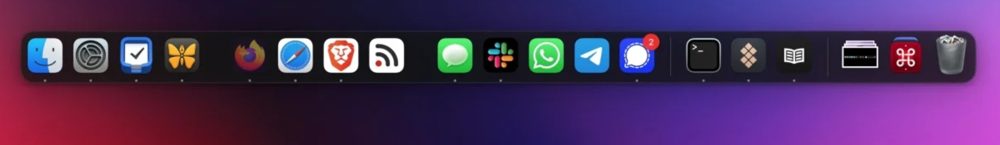

# macos.dock

A compact, bottom-centered macOS-inspired dock plugin for Omarchy.



## Features

- Glassy floating dock surface
- Subtle hover scaling and application tooltips
- Pinned application persistence
- Running-application indicators
- Pin, unpin, new-window, and close actions
- Live window previews on hover, with cached thumbnail fallbacks
- Custom macOSicons, local PNG, and WebP icon overrides
- Point-and-click icon picker: right-click any app and choose "Get Info…" to
  change its icon from macOSicons, your own image, or a direct image URL — no
  terminal needed
- "Manage Icons…" lets you assign icons to *any* installed app, even before it
  first appears on the dock
- macOS-style Alt+Tab application switcher (most-recently-used order)
- Auto-hide by default: the dock glides completely off-screen after 1s
  idle and reveals when the cursor hits the bottom 3px edge (100ms
  delay, 380ms hide / 280ms reveal). Tiled windows use the full screen
  — the dock overlays them like macOS. Toggle via dock menu or IPC,
  persists in `~/.config/omarchy/dock-settings.json`
- Tiling window adaptation: when auto-hide is off, it reserves its footprint
  as a Wayland exclusive zone, so tiled windows never overlap it

## Install

Add and enable the plugin through Omarchy's plugin manager. The plugin's own
id is `macos.dock` (`manifest.json`'s `id` field), not the repository name:

```bash
omarchy plugin add https://github.com/ifubaraboye/omarchy-dock.git
omarchy plugin enable macos.dock
```

The custom-icon helper (search, set, list, clear — see "Custom icons" below) lives in the plugin's own `scripts/` directory, but nothing in Omarchy's plugin system installs it onto `PATH`; do it once by hand:

```bash
ln -sf ~/.config/omarchy/plugins/macos.dock/scripts/omarchy-dock-icon ~/.local/bin/omarchy-dock-icon
```

Without this, both the point-and-click picker and the `omarchy-dock-icon` CLI fail — the dock itself works fine either way.

The dock stores pins and auto-hide preference in:

```text
~/.config/omarchy/dock-pinned-macos.json
~/.config/omarchy/dock-settings.json
```

## Requirements and removal

This plugin requires Omarchy with Quickshell, plus `bash`, `curl`, `python3`,
ImageMagick (`magick` or `convert` and `identify`), and `xdg-open` for the
optional custom-icon helper.

For the best experience, use **floating windows** (not tiling): the dock is
designed to work with a floating layout where windows overlap its surface, and
it behaves best when windows are allowed to float over it rather than being
tiled up to its edges.

Tiled layouts are supported too: while the dock is visible ("Always Show"
mode), it claims its footprint (dock surface plus bottom margin) as a Wayland
exclusive zone, so tiled Hyprland windows reserve that space and never overlap
the dock. Hiding the dock releases the zone and tiled windows reclaim the
space. Floating windows are unaffected and may still overlap the dock by
design.

To remove the plugin, disable it and delete its installed directory (same id
as Install above, `macos.dock` — not the repository name; `disable` against a
nonexistent id exits 0 and disables nothing, so this is easy to get wrong
silently):

```bash
omarchy plugin disable macos.dock
rm -rf ~/.config/omarchy/plugins/macos.dock
omarchy restart shell
```

The plugin does not overwrite existing Omarchy or user configuration files.
It only creates or updates its own files under `~/.config/omarchy/` after the
user explicitly invokes a dock action or the custom-icon helper. Custom icon
files and mappings can be removed with `omarchy-dock-icon clear <app-id>`.

The repository author owns this plugin and has permission to submit the source
code and preview assets. External icons downloaded from macOSicons remain
subject to their respective rights and terms; users should only use assets
they are permitted to use.

Plugin-directory approval is for listing in the Omarchy plugin directory and
is not a security review or endorsement. Review the source and dependencies
before installing.

## Custom icons

### Point-and-click

No terminal required:

- **Right-click an app on the dock → "Get Info…"** opens an icon picker with
  suggested icons from macOSicons (searched by the app's name), a live search
  box, and options to use your own image or a direct image URL.
- **Right-click any app or empty dock space → "Manage Icons…"** browses every
  installed app. You can change an icon for an app that isn't on the dock yet —
  the icon is stored by app id, so it appears automatically the moment the app
  opens.

The picker applies changes instantly through the same helper the CLI uses
(download, trim, rounded corners, persistence) and the dock updates live.

### Apps with no icon at all (not even a generic one)

A few apps ship their `.desktop` file with `NoDisplay=true` — meaning "don't list me in an app launcher." QEMU is one (`qemu.desktop`, present when the `qemu` package is installed): a window with class `qemu` gets no icon anywhere in the dock, not even the generic fallback other unmatched windows get. This is not this plugin refusing to look one up: Quickshell's own `DesktopEntries.applications` list excludes `NoDisplay` entries before any plugin code runs, and there is no property on it to ask for them too.

"Manage Icons…" won't offer these apps either, since it browses that same list. The CLI is the only way in, because it takes the id directly instead of browsing a list:

```bash
omarchy-dock-icon set qemu --file ~/Pictures/qemu-icon.png
```

Any icon file works — nothing requires it to come from the app's own theme.

### Command line

For scripting, the same operations are available from a terminal:

```bash
omarchy-dock-icon search figma
omarchy-dock-icon set code figma-i3FsrkYvf6
omarchy-dock-icon set code --file ~/Pictures/code.png
omarchy-dock-icon set code https://example.com/icon.png
omarchy-dock-icon list
omarchy-dock-icon clear code
omarchy-dock-icon folder
```

The dock visibility shortcut is `SUPER + H`. It can also be controlled from a
terminal:

```bash
omarchy-shell macos.dock hide
omarchy-shell macos.dock show
omarchy-shell macos.dock toggle
```

Auto-hide is **enabled by default** (fresh installs and existing installs without
`dock-settings.json` both default to ON). The dock waits **1000ms** of idle
before gliding **380ms** completely off-screen; hitting the bottom **3px** edge
reveals it after **100ms** with a **280ms** glide up. It stays visible while
the cursor is over the dock *or* the bottom edge (`dockEngaged`), and hide is
suppressed while a menu, icon picker, window preview, drag, or Alt+Tab HUD is
active. Auto-hide can be toggled without restarting the shell:

```bash
# Right-click any dock icon → Turn Hiding Off / On
omarchy-shell -q macos.dock toggleAutoHide
omarchy-shell -q macos.dock setAutoHide true
omarchy-shell -q macos.dock setAutoHide false
omarchy-shell -q macos.dock getAutoHide
```

The preference is persisted in `~/.config/omarchy/dock-settings.json` and survives
restarts. When auto-hide is on, tiled windows use the full screen and the dock
overlays them; when off, the dock reserves its footprint as an exclusive zone.

## Alt+Tab application switcher

The plugin ships a macOS-style app switcher (a glass pill with the running
applications in most-recently-used order). No setup is needed: when the shell
starts, the plugin registers the bindings automatically:

- `ALT + GRAVE` (Alt + `` ` ``) — next application
- `ALT + SHIFT + GRAVE` (Alt + Shift + `` ` ``) — previous application

Behavior:

- Hold `Alt`, press `` ` `` to cycle forward, `Shift + `` ` `` to cycle
  backward. The first press selects the application after the currently
  focused one, like macOS.
- Release `Alt` to activate the selected application (its most recently
  focused window, or launch it if none is open).
- `Enter` activates the selection, `Escape` cancels without changing focus,
  arrow keys move the selection, and the mouse can hover to select or click
  to activate.
- The switcher opens on the dock's primary screen and cycles applications
  only — pinned-but-closed applications are never included.

### Changing the keybind

The registered binds live only for the current session (they are re-added at
each shell start and never written to any config file). To use a different
combination, add your own bind to `~/.config/hypr/bindings.lua` — your
config-file bind takes precedence over the plugin's default:

```lua
o.bind("ALT + TAB", "App switcher next", "omarchy-shell -q macos.dock altTabNext")
o.bind("ALT + SHIFT + TAB", "App switcher prev", "omarchy-shell -q macos.dock altTabPrev")
```

Note: Omarchy's default config already binds `ALT + TAB` to window cycling, so
if you rebind to `ALT + TAB` you must first free it with `hl.unbind("ALT + TAB")`
in your `bindings.lua` (and `hl.unbind("ALT + SHIFT + TAB")` for the previous
direction).

For testing without bindings:

```bash
omarchy-shell -q macos.dock altTabNext
omarchy-shell -q macos.dock altTabPrev
omarchy-shell -q macos.dock altTabCancel
```

Icons are normalized into transparent macOS-style rounded PNGs and metadata is
stored in `~/.config/omarchy/icons/` and `~/.config/omarchy/dock-icons.json`.
Changes are watched and applied without restarting the shell. The helper is installed at
`~/.local/bin/omarchy-dock-icon`.

## Configuration

The dock keeps all of its state under `~/.config/omarchy/`. Only `autoHide` is
a persisted *setting*; pins, order, and icon overrides are managed through the
UI or the icon CLI. Timing, sizes, and geometry are baked in and not yet
user-configurable.

### Settings

| Setting | Type | Default | Stored in | Description |
|---|---|---|---|---|
| `autoHide` | bool | `true` | `dock-settings.json` | Glide off-screen when idle and reveal from the bottom edge. When off, the dock reserves its footprint as an exclusive zone. |
| `pinned` | string[] | `[]` | `dock-pinned-macos.json` | App ids pinned to the dock (persists via Pin/Unpin). |
| `order` | string[] | `[]` | `dock-pinned-macos.json` | Full spatial order of dock items (pinned + running). |
| custom icon mappings | object | `{}` | `dock-icons.json` | Per-app-id icon override (`file`, `source`, `imageUrl`). Managed via "Get Info…", "Manage Icons…", or `omarchy-dock-icon`. |

### IPC commands

All commands are invoked as `omarchy-shell [-q] macos.dock <command>`:

| Command | Args | Description |
|---|---|---|
| `toggle` | — | Show/hide the dock |
| `show` | — | Show the dock |
| `hide` | — | Hide the dock |
| `toggleAutoHide` | — | Toggle auto-hide (persisted) |
| `setAutoHide` | `true`/`false` | Set auto-hide explicitly (persisted) |
| `getAutoHide` | — | Print current auto-hide state |
| `altTabNext` | — | Next application in the switcher |
| `altTabPrev` | — | Previous application in the switcher |
| `altTabCancel` | — | Dismiss the switcher without changing focus |

### Built-in constants (not configurable)

- Timing: 1000ms idle hide delay, 100ms edge-reveal delay, 380ms hide / 280ms
  show animation, 180ms window-preview delay, 300ms persist debounce
- Geometry: dock height 101px, bottom margin 8px, icon size 50px, slot width
  58px, slot spacing 8px, side padding 18px, hover scale 1.36, corner radius 18
- Edge trigger: bottom 3px of the screen

### Full default config file

`~/.config/omarchy/dock-settings.json`:

```json
{
  "version": 1,
  "autoHide": true
}
```

For reference, the companion files with all defaults applied:

`~/.config/omarchy/dock-pinned-macos.json`:

```json
{
  "version": 1,
  "pinned": [],
  "order": []
}
```

`~/.config/omarchy/dock-icons.json`:

```json
{}
```

## Development

```bash
./tests/run.sh
qmllint DockPanel.qml DockItem.qml DockMenu.qml
```

The dock is intended for a single primary output and uses the first configured Quickshell screen.
